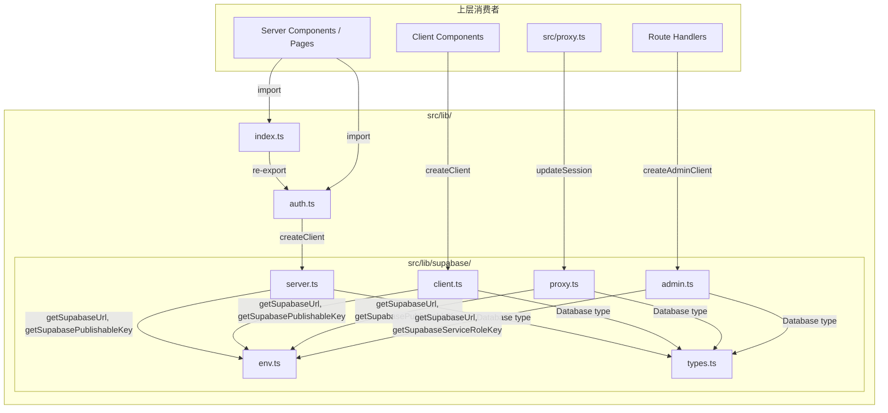
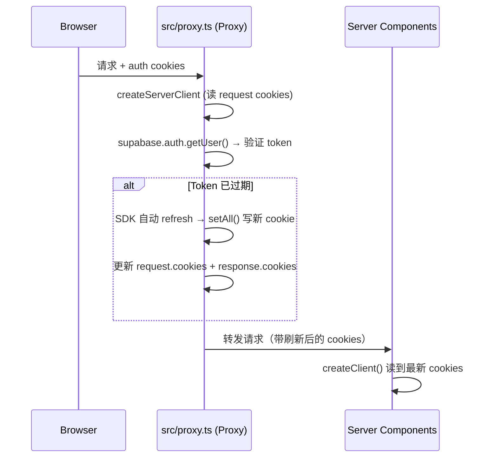
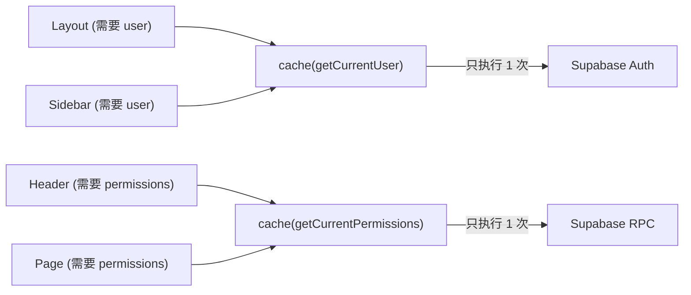

# `src/lib` 模块架构分析

## 1. 概览

`src/lib/` 是 **next-admin** 项目的基础设施层（Infrastructure Layer），负责两件事：

1. **Supabase 客户端管理** — 按运行时环境（浏览器 / Server Component / Proxy / Admin 脚本）提供正确配置的 Supabase 实例。
2. **认证 & 权限查询** — 在 Server Component 侧提供请求级缓存的用户、Profile、权限查询函数。

```
src/lib/
├── index.ts              ← 统一导出入口
├── auth.ts               ← 上层：认证 & 权限查询（React cache）
└── supabase/
    ├── env.ts            ← 环境变量集中管理
    ├── types.ts          ← Database 类型定义
    ├── client.ts         ← 浏览器端客户端（"use client"）
    ├── server.ts         ← Server Component / Route Handler 客户端
    ├── proxy.ts          ← Next.js 16 Proxy（原 Middleware）Cookie 刷新
    └── admin.ts          ← Service Role 管理员客户端（绕过 RLS）
```

---

## 2. 依赖关系图



> **关键原则**：所有 Supabase 客户端都通过 `env.ts` 获取配置，通过 `types.ts` 获取类型；上游代码永远不直接读 `process.env`。

---

## 3. 文件逐一分析

### 3.1 `supabase/env.ts` — 环境变量集中管理

| 函数 | 暴露的密钥 | 安全等级 |
|------|-----------|---------|
| `getSupabaseUrl()` | 项目 URL（公开） | 🟢 可暴露给浏览器 |
| `getSupabasePublishableKey()` | anon / publishable key（公开） | 🟢 可暴露给浏览器 |
| `getSupabaseServiceRoleKey()` | service role key | 🔴 **仅服务端** |

**设计意图：**

- **单点管理**：避免在 4 个客户端文件中各自 `process.env.XXX`，防止拼写错误和遗漏。
- **Fail-fast**：缺少环境变量时立即 `throw Error`，不让模糊的 "Invalid URL" 错误传播到运行时深处。
- **兼容性**：同时支持 `NEXT_PUBLIC_SUPABASE_PUBLISHABLE_KEY`（Supabase 新面板命名）和 `NEXT_PUBLIC_SUPABASE_ANON_KEY`（旧命名），通过 `??` 运算符优雅回退。

### 3.2 `supabase/types.ts` — Database 类型定义

手写的 Supabase `Database` 类型，映射了 5 张核心表和 3 个 RPC 函数：

| 表 | 用途 |
|----|------|
| `profiles` | 用户资料，1:1 关联 Supabase Auth `auth.users` |
| `roles` | 角色（RBAC 角色表） |
| `permissions` | 权限/菜单（树形结构，支持 MENU / BUTTON 两种类型） |
| `user_roles` | 用户-角色关联（多对多） |
| `role_permissions` | 角色-权限关联（多对多） |

| RPC 函数 | 用途 |
|----------|------|
| `get_current_user_permissions` | 获取当前登录用户的所有权限 |
| `get_menu_tree` | 获取菜单树（JSON） |
| `validate_menu_path` | 校验菜单路径是否合法 |

**设计意图：**

- 使用泛型 `TableDefinition<Row, Insert, Update>` 工具类型，一套定义同时生成 Row / Insert / Update 三种类型，减少重复。
- 注释中明确标注"schema 稳定后应替换为 `supabase gen types` 自动生成"，说明这是**过渡方案**。
- `permissions` 表的设计融合了**菜单路由**（path, component, layout, keep_alive）和**API 权限**（method），是一种 Admin 系统常见的"菜单即权限"模型。

### 3.3 `supabase/client.ts` — 浏览器端客户端

```typescript
"use client";  // ← 关键：标记为 Client Component 专用
```

- 使用 `@supabase/ssr` 的 `createBrowserClient`，自动处理浏览器端的 Cookie 读写。
- 泛型 `<Database>` 确保所有查询都有类型提示。
- **不**处理 Cookie 回调 — 浏览器端由 Supabase SDK 内部处理。

### 3.4 `supabase/server.ts` — Server Component 客户端

**核心设计：** 使用 `next/headers` 的 `cookies()` 读写 auth cookie。

```typescript
export async function createClient() {
  const cookieStore = await cookies();
  return createServerClient<Database>(url, key, {
    cookies: {
      getAll()  { return cookieStore.getAll(); },
      setAll(cookiesToSet) {
        try {
          cookiesToSet.forEach(({ name, value, options }) => {
            cookieStore.set(name, value, options);
          });
        } catch {
          // Server Components 不总是允许写 Cookie，这里静默吞掉错误
        }
      },
    },
  });
}
```

**为什么 `setAll` 用 `try/catch` 包裹？**

> Server Components 在渲染阶段是**只读**的，无法修改响应头。如果 Supabase SDK 尝试刷新 token 并写回 Cookie，会抛出异常。只要 `src/proxy.ts` 已经在请求到达前完成了 `updateSession()`，这里写失败是安全的。

还导出了一个便捷的 `getCurrentUser()` 函数，注释强调**用 `getUser()` 而非 `getSession()`** — 因为前者会向 Supabase Auth 服务器验证 token 有效性，后者只信任本地 Cookie 内容。

### 3.5 `src/lib/supabase/proxy.ts` — Proxy 层 Cookie 刷新

这是整个认证流程的**关键枢纽**。



**设计亮点：**

- **Next.js 16 Proxy**（原 Middleware）是唯一一个既能读又能写 Cookie 的时机，所以 token 刷新放在这里。
- `setAll` 回调同时更新了 `request.cookies`（让下游 Server Component 看到新值）和 `response.cookies`（让浏览器保存新值），以及透传 `headers`（Supabase SDK 可能设置的额外响应头）。
- 注释明确提醒"不要在 `createServerClient` 和 `getUser()` 之间插入无关逻辑"，以确保 Cookie 刷新时序正确。

### 3.6 `supabase/admin.ts` — 管理员客户端

```typescript
export function createAdminClient() {
  return createClient<Database>(url, serviceRoleKey, {
    auth: {
      autoRefreshToken: false,    // 不需要自动刷新（无用户会话）
      persistSession: false,      // 不持久化（无 Cookie/LocalStorage）
    },
  });
}
```

- 使用 **service role key** 绕过所有 RLS 策略，拥有超级管理员权限。
- 注释反复强调**绝对不能在 Client Component 中引入**。
- 关闭 `autoRefreshToken` 和 `persistSession` — 因为 admin client 不关联任何用户会话，纯粹是后端服务身份。

### 3.7 `auth.ts` — 上层认证查询

基于 `supabase/server.ts` 的 `createClient`，封装了三个 `cache()` 包裹的查询函数：

| 函数 | 作用 | 返回 |
|------|------|------|
| `getCurrentUser()` | 获取当前登录用户（Auth） | `User \| null` |
| `getCurrentProfile()` | 获取用户 Profile（数据库） | `Profile \| null` |
| `getCurrentPermissions()` | 获取用户权限列表（RPC） | `Permission[]` |

**为什么用 `React.cache()`？**

> 在一次 SSR 请求中，多个 Server Component 可能同时需要用户信息。没有 `cache()` 的话，每个组件都会独立发起 Supabase Auth 请求。`cache()` 保证**同一请求内只调用一次**，后续调用直接返回缓存结果。



### 3.8 `index.ts` — 统一导出

```typescript
export * from "@/lib/auth";
```

仅 re-export `src/lib/auth.ts`，作为上层 page/layout 的简便导入路径。注意 `src/lib/supabase/` 子模块**不**通过 `index.ts` 导出 — 这是有意为之，强制消费者明确选择正确的客户端（`client` vs `server` vs `admin`），避免在错误的运行时环境中使用。

---

## 4. 设计原则总结

### 4.1 按运行时环境分层

| 运行时 | 文件 | 认证方式 |
|--------|------|---------|
| 浏览器（Client Component） | `src/lib/supabase/client.ts` | Publishable key + 浏览器 Cookie |
| Server Component / Route Handler | `src/lib/supabase/server.ts` | Publishable key + `next/headers` Cookie |
| Proxy（请求拦截层） | `src/proxy.ts` + `src/lib/supabase/proxy.ts` | Publishable key + Request/Response Cookie |
| 后台脚本 / 管理操作 | `src/lib/supabase/admin.ts` | Service role key（无 Cookie） |

> **核心约束**：4 种场景对 Cookie 的读写方式完全不同，所以需要 4 个独立的 `createClient` 工厂函数。这是 Supabase + Next.js SSR 的官方推荐模式。

### 4.2 安全边界

```
┌─────────────────────────────────────────┐
│  🟢 浏览器安全（可暴露）                    │
│  • NEXT_PUBLIC_SUPABASE_URL              │
│  • NEXT_PUBLIC_SUPABASE_PUBLISHABLE_KEY  │
│  • client.ts                             │
├─────────────────────────────────────────┤
│  🔴 仅服务端（绝不暴露）                    │
│  • SUPABASE_SERVICE_ROLE_KEY             │
│  • admin.ts                              │
└─────────────────────────────────────────┘
```

- `client.ts` 加了 `"use client"` 指令 → 明确标记为浏览器端。
- `admin.ts` 不加 `"use client"` 且使用 `SUPABASE_SERVICE_ROLE_KEY`（无 `NEXT_PUBLIC_` 前缀）→ Next.js 的 tree-shaking 保证这个密钥不会打包到客户端 bundle。
- `env.ts` 的 `getSupabaseServiceRoleKey()` 使用运行时读取 `process.env`（而非模块顶层常量），进一步确保只有在服务端代码路径执行时才会访问。

### 4.3 关注点分离

| 层次 | 职责 |
|------|------|
| `env.ts` | 环境变量读取 + 校验 |
| `types.ts` | 数据库 Schema 类型 |
| `client/server/proxy/admin.ts` | 按运行时环境创建 Supabase 实例 |
| `auth.ts` | 认证业务逻辑 + 请求级缓存 |
| `index.ts` | 公共 API 导出 |

每个文件只做一件事，替换任何一层都不影响其他层。

### 4.4 渐进式演进

代码中多处留有"演进注释"：
- `src/lib/supabase/types.ts` → "schema 稳定后替换为自动生成类型"
- `src/lib/auth.ts` → `getCurrentProfile` 注释提到"RLS 策略在迁移后补充"
- `src/lib/auth.ts` → `getCurrentPermissions` 注释提到"RPC 将在 Supabase migrations 中实现"
- `src/proxy.ts` → "路由级重定向待 /login 和 protected layout 完成后添加"

这说明模块设计考虑了**分阶段交付**，先搭骨架、后补安全策略。

---

## 5. 潜在改进方向

| 方向 | 说明 |
|------|------|
| 自动生成类型 | `src/lib/supabase/types.ts` 目前手写，应迁移到 `supabase gen types typescript` 自动生成 |
| 错误处理增强 | `src/lib/auth.ts` 中错误一律返回 `null / []`，可考虑引入错误日志或 Sentry 上报 |
| Proxy 路由守卫 | 当前 `src/proxy.ts` 仅刷新 Cookie，未实现未认证用户重定向到 `/login` 的逻辑 |
| `server.ts` 重复 | `src/lib/supabase/server.ts` 导出了 `getCurrentUser()`，与 `src/lib/auth.ts` 中的同名函数有重叠，建议统一 |
| 类型导出 | `src/lib/supabase/types.ts` 中的 `PermissionType`, `HttpMethod` 等辅助类型未通过 `index.ts` 导出，需要时可考虑补充 |
