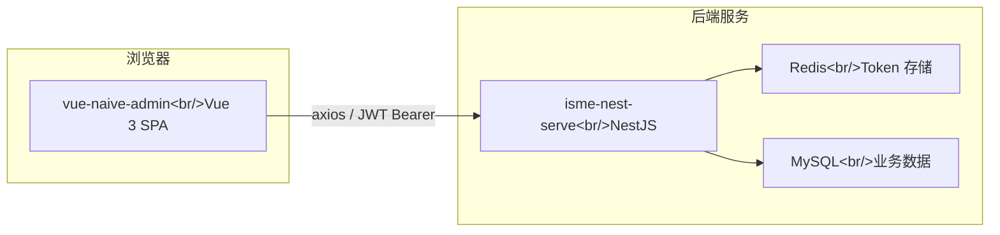
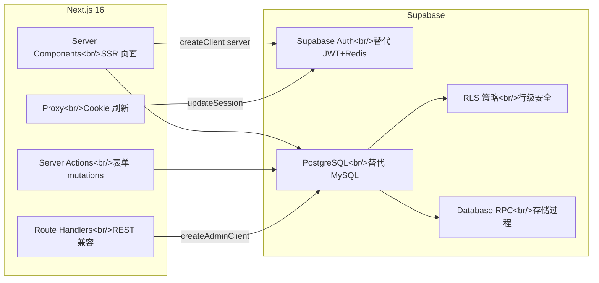

# Next-Admin 迁移规划：Vue + Nest → Next.js + Supabase

## 1. 现状分析

当前 monorepo 包含三个项目：

```
app/
├── vue-naive-admin      ← Vue 3 前端（SPA, Vite, Naive UI, Pinia）
├── isme-nest-serve      ← NestJS 后端（TypeORM, MySQL, Redis, JWT）
└── next-admin           ← 新项目（Next.js 16, Supabase, 已搭好 src/lib 骨架）
```

### 1.1 原架构总览



### 1.2 目标架构



> **核心变化**：消除独立后端（NestJS），用 Supabase 替代 MySQL + Redis + 自定义 JWT，用 Next.js Server Actions / Route Handlers 替代 REST API。

---

## 2. 模块映射关系

### 2.1 数据库表映射（MySQL → Supabase PostgreSQL）

| MySQL 表 | Supabase 表 | 变更说明 |
|----------|------------|---------|
| `user` | `auth.users` + `profiles` | 认证字段移入 Supabase Auth；profile 信息保留在 `public.profiles` 表，`id` 改为 UUID 关联 `auth.users.id` |
| `profile` | `profiles`（合并） | 原 `profile.userId` 外键改为 `profiles.id = auth.users.id` 一对一 |
| `role` | `roles` | 字段名 snake_case 化（已完成于 `types.ts`）；新增 `created_at`, `updated_at` |
| `permission` | `permissions` | `parentId` → `parent_id`；`keepAlive` → `keep_alive`；保留树形结构 |
| `user_roles_role` | `user_roles` | 联合主键 `(user_id, role_id)`，`userId` → `user_id`（UUID） |
| `role_permissions_permission` | `role_permissions` | 联合主键 `(role_id, permission_id)` |

> [!IMPORTANT]
> `user` 表的 `password` 字段不再需要手动管理 — Supabase Auth 内置密码哈希。`bcryptjs` 依赖可移除。

### 2.2 后端 API 映射（Nest Controller → Next.js）

#### Auth 模块

| Nest 端点 | 替代方案 | 说明 |
|----------|---------|------|
| `POST /auth/login` | Supabase `signInWithPassword()` | 由客户端直接调用 Supabase Auth，无需自建 API |
| `POST /auth/register` | Supabase `signUp()` | 同上 |
| `GET /auth/refresh/token` | Supabase 自动 Token 刷新 | `src/proxy.ts` 的 `updateSession()` 已实现 |
| `POST /auth/logout` | Supabase `signOut()` | 客户端直接调用 |
| `POST /auth/current-role/switch/:roleCode` | **Server Action** | 更新 `profiles.current_role_id`，需自定义逻辑 |
| `GET /auth/captcha` | 可选：移除 或 Route Handler | Supabase Auth 自带 rate limiting；可用 Turnstile/reCAPTCHA 替代 |
| `POST /auth/password` | Supabase `updateUser({ password })` | 客户端调用 + Server Action 验证旧密码 |

> [!WARNING]
> 原系统使用 **Redis 存储 JWT** 实现"单点登录 + Token 续期"。Supabase Auth 不支持 Redis-backed token revocation。如果需要"踢人下线"功能，需要通过 Supabase Admin API `admin.auth.admin.signOut(userId)` 实现。

#### User 模块

| Nest 端点 | 替代方案 | 说明 |
|----------|---------|------|
| `GET /user/detail` | `src/lib/auth.ts` → `getCurrentUser()` + `getCurrentProfile()` | 已实现（React cache） |
| `GET /user` | **Server Component** 直接查询 | `supabase.from('profiles').select(...)` |
| `POST /user` | **Server Action** | 调用 `createAdminClient().auth.admin.createUser()` |
| `PATCH /user/:id` | **Server Action** | 更新 profile + user_roles |
| `DELETE /user/:id` | **Server Action** | `admin.auth.admin.deleteUser(id)` + 级联删除 profile |
| `PATCH /user/profile/:id` | **Server Action** | RLS 限制只能本人修改 |
| `PATCH /user/password/reset/:userId` | **Server Action** | `admin.auth.admin.updateUserById(id, { password })` |

#### Role 模块

| Nest 端点 | 替代方案 | 说明 |
|----------|---------|------|
| `GET /role` | Server Component 直接查询 | `supabase.from('roles').select()` |
| `GET /role/page` | Server Component + 分页 | 可用 Supabase `.range()` |
| `POST /role` | Server Action | 插入 role + role_permissions |
| `PATCH /role/:id` | Server Action | 更新 role |
| `DELETE /role/:id` | Server Action | 检查是否有关联用户后删除 |
| `GET /role/permissions/tree` | `src/lib/auth.ts` → `getCurrentPermissions()` | 已有 RPC `get_current_user_permissions` |
| `POST /role/permissions/add` | Server Action | 更新 role_permissions 关联 |
| `PATCH /role/users/add/:roleId` | Server Action | 更新 user_roles 关联 |

#### Permission 模块

| Nest 端点 | 替代方案 | 说明 |
|----------|---------|------|
| `GET /permission` | Server Component 查询 | `supabase.from('permissions').select()` |
| `GET /permission/tree` | Supabase RPC `get_menu_tree` | 已在 `types.ts` 中定义 |
| `POST /permission` | Server Action | SUPER_ADMIN 专属 |
| `PATCH /permission/:id` | Server Action | |
| `DELETE /permission/:id` | Server Action | 检查关联角色后删除 |
| `GET /permission/menu/validate` | Supabase RPC `validate_menu_path` | 已在 `types.ts` 中定义 |

### 2.3 前端状态管理映射（Pinia Store → Next.js）

| Vue Store | Next.js 替代 | 说明 |
|----------|-------------|------|
| `auth` (token) | Supabase Cookie（自动管理） | 无需手动存储 token |
| `user` (userInfo) | `src/lib/auth.ts` → `getCurrentUser/Profile()` | Server Component 直接获取，不需要全局 store |
| `permission` (menus, routes) | Server Component + Supabase RPC | 菜单树由服务端渲染，不需要客户端 store |
| `router` (vue-router) | Next.js App Router（文件系统路由） | 动态路由通过 RPC 验证 |
| `tab` (标签页) | React Context 或 zustand | 纯 UI 状态，需客户端 store |
| `app` (主题/折叠) | React Context 或 CSS 变量 | 纯 UI 状态 |

---

## 3. 关键设计决策

### 3.1 认证流程对比

```mermaid
graph TD
    subgraph "原流程 Nest + JWT + Redis"
        A1["输入用户名密码 + 验证码"] --> A2["POST /auth/login"]
        A2 --> A3["bcrypt 比对密码"]
        A3 --> A4["生成 JWT + 存入 Redis"]
        A4 --> A5["返回 accessToken"]
        A5 --> A6["前端 Pinia 持久化存储"]
        A6 --> A7["每次请求 Bearer Token"]
        A7 --> A8["JwtStrategy 验证 + Redis 比对"]
    end

    subgraph "新流程 Next.js + Supabase Auth"
        B1["输入用户名密码"] --> B2["signInWithPassword"]
        B2 --> B3["Supabase Auth 验证"]
        B3 --> B4["返回 Session HttpOnly Cookie"]
        B4 --> B5["Proxy 自动刷新 Cookie"]
        B5 --> B6["Server Component 调用 getUser"]
        B6 --> B7["Supabase 验证 JWT 内置"]
    end
```



**核心优势**：
- 无需手动管理 JWT 签发/验证/Redis 存储
- HttpOnly Cookie 比 localStorage 更安全（防 XSS）
- Proxy 层自动 Token 刷新，用户无感知

### 3.2 权限控制对比

| 机制 | 原系统 | 新系统 |
|------|--------|--------|
| API 鉴权 | Nest `JwtGuard` + `RoleGuard` | Supabase RLS + Server Action 中手动检查 |
| 前端菜单 | 后端返回权限树 → 前端动态生成路由 | Supabase RPC `get_current_user_permissions` → Server Component 渲染菜单 |
| 按钮权限 | `permission` store 中 `btns` 字段 | Server Component 传入 `btns` prop，或 Context 下发 |
| 超管判断 | `@Roles('SUPER_ADMIN')` 装饰器 | RLS policy + Server Action 中 `getCurrentPermissions()` 检查 |

### 3.3 Supabase RLS 策略设计

```sql
-- profiles: 用户只能读自己的 profile，管理员可读所有
CREATE POLICY "Users can view own profile"
  ON profiles FOR SELECT
  USING (auth.uid() = id);

CREATE POLICY "Admins can view all profiles"
  ON profiles FOR SELECT
  USING (
    EXISTS (
      SELECT 1 FROM user_roles ur
      JOIN roles r ON r.id = ur.role_id
      WHERE ur.user_id = auth.uid()
      AND r.code = 'SUPER_ADMIN'
    )
  );

-- permissions: 用户只能读自己角色关联的权限
CREATE POLICY "Users can read own permissions"
  ON permissions FOR SELECT
  USING (
    EXISTS (
      SELECT 1 FROM role_permissions rp
      JOIN user_roles ur ON ur.role_id = rp.role_id
      WHERE ur.user_id = auth.uid()
      AND rp.permission_id = permissions.id
    )
  );

-- 写操作统一通过 admin client (service role) 绕过 RLS
```

### 3.4 菜单路由方案

原系统使用**动态路由**：后端返回权限树 → 前端 `addRoute()` 注册。

Next.js App Router 是**文件系统路由**，不支持运行时动态注册。替代方案：

```
src/app/
├── (auth)/
│   ├── login/page.tsx
│   └── register/page.tsx
├── (admin)/
│   ├── layout.tsx          ← 鉴权 + 菜单布局（Server Component）
│   ├── page.tsx            ← 首页/仪表板
│   ├── pms/
│   │   ├── user/page.tsx   ← 用户管理
│   │   ├── role/page.tsx   ← 角色管理
│   │   └── resource/page.tsx ← 资源管理
│   ├── profile/page.tsx    ← 个人资料
│   └── demo/
│       └── upload/page.tsx ← 图片上传
```

**菜单渲染逻辑**：
1. `(admin)/layout.tsx` 中调用 `getCurrentPermissions()` 获取权限列表
2. 将权限过滤为 `type === 'MENU'` 的条目，构建菜单树
3. **所有页面文件物理存在**，但菜单只显示有权限的条目
4. 页面级鉴权：在每个 `page.tsx` 的 Server Component 中检查权限，无权限则 `redirect('/403')` 或 `notFound()`

> [!IMPORTANT]
> 这与原系统"动态路由"的思路不同。原系统中**路由本身就不存在**（未注册），新系统中**路由存在但被权限守卫拦截**。两者安全性等价，但实现方式不同。

---

## 4. 分阶段交付计划

### Phase 0：基础设施（✅ 已完成）
- [x] `src/lib/supabase/` 四种客户端（client / server / proxy / admin）
- [x] `src/lib/auth.ts` 认证查询（getCurrentUser / Profile / Permissions）
- [x] `src/proxy.ts` Cookie 刷新
- [x] `src/lib/supabase/types.ts` 数据库类型定义

### Phase 1：数据库迁移
- [ ] 编写 Supabase migration SQL（创建 5 张表 + RLS 策略）
- [ ] 编写 3 个 RPC 函数（`get_current_user_permissions`, `get_menu_tree`, `validate_menu_path`）
- [ ] 导入种子数据（初始角色、权限、管理员账户）
- [ ] 用 `supabase gen types` 替换手写 `types.ts`

### Phase 2：认证流程
- [ ] 创建登录页 `(auth)/login/page.tsx`
- [ ] 实现 `signInWithPassword` + 错误处理
- [ ] 实现注册页（可选）
- [ ] `src/proxy.ts` 增加未登录重定向 → `/login`
- [ ] 实现角色切换 Server Action

### Phase 3：Admin 布局 & 菜单
- [ ] 创建 `(admin)/layout.tsx` — 侧边栏 + 顶栏 + 内容区
- [ ] 基于权限树渲染动态菜单（Server Component）
- [ ] 实现折叠/展开、面包屑、标签页（Client Component）
- [ ] 响应式适配

### Phase 4：业务页面
- [ ] 用户管理页（CRUD + 分配角色）
- [ ] 角色管理页（CRUD + 分配权限）
- [ ] 资源/权限管理页（树形 CRUD）
- [ ] 个人资料页
- [ ] 首页/仪表板

### Phase 5：打磨 & 验证
- [ ] 按钮级权限检查
- [ ] 错误边界 + 404/403 页面
- [ ] 表单校验（zod / valibot）
- [ ] 日志 & 监控
- [ ] E2E 测试（Playwright）

---

## 5. 需要废弃/替代的依赖

### 不再需要的 Nest 依赖

| 原依赖 | 替代 | 原因 |
|--------|------|------|
| `@nestjs/*` 全家桶 | Next.js App Router | 整个 Nest 框架被替代 |
| `typeorm` + `mysql2` | Supabase Client SDK | ORM → Supabase 查询 |
| `redis` | Supabase Auth 内置 Token 管理 | 不再需要 Redis 存 JWT |
| `bcryptjs` | Supabase Auth 内置密码哈希 | |
| `passport` + `passport-jwt` | Supabase Auth + Proxy | |
| `svg-captcha` | Cloudflare Turnstile / 移除 | Supabase 自带 rate limiting |
| `express-session` | Supabase Cookie (HttpOnly) | |

### 不再需要的 Vue 依赖

| 原依赖 | 替代 | 原因 |
|--------|------|------|
| `vue` + `vue-router` | React 19 + Next.js App Router | |
| `pinia` | React Context / zustand（仅 UI 状态） | |
| `naive-ui` | shadcn/ui 或 Ant Design 5 等 React 组件库 | |
| `axios` | Supabase Client SDK + `fetch` | |
| `echarts` + `vue-echarts` | `recharts` 或 `echarts`（React 封装） | |
| `unocss` | Tailwind CSS 4（已在 devDeps） | |

---

## 6. 需要用户决策的问题

> [!IMPORTANT]
> ### Q1: UI 组件库选择
> 原系统使用 **Naive UI**（Vue 3）。迁移到 React 后需要选择新的组件库：
> - **shadcn/ui** — 无运行时依赖，完全可定制，社区热度最高
> - **Ant Design 5** — 功能最全面，Admin 系统常用，开箱即用
> - **其他** — MUI, Mantine, NextUI, etc.
>
> 建议：Admin 系统场景下 **Ant Design 5** 的 Table / Form / Tree 组件成熟度最高。

> [!IMPORTANT]
> ### Q2: 验证码策略
> 原系统使用 `svg-captcha` 服务端验证码。迁移后有两个选项：
> - **移除验证码** — Supabase Auth 自带 rate limiting + 可启用 MFA
> - **替换为 Turnstile** — 无感验证，UX 更好
>
> 建议：移除 svg-captcha，启用 Supabase 的 rate limiting。

> [!IMPORTANT]
> ### Q3: "踢人下线"功能
> 原系统通过 Redis 删除 Token 实现即时踢人。Supabase 的替代方案：
> - `admin.auth.admin.signOut(userId)` — 使该用户所有 session 失效
> - 但有约 5 分钟的 JWT 缓存窗口期（Supabase 默认 JWT 有效期 1 小时）
>
> 如果需要即时踢人，可将 JWT 有效期缩短到 5 分钟（代价是更频繁的 Token 刷新）。

> [!IMPORTANT]
> ### Q4: 角色切换机制
> 原系统允许用户在多个角色之间切换（生成新 JWT），需要确认：
> - 是否保留多角色切换功能？
> - 如果保留，建议存储在 `profiles.current_role_id`，切换时通过 Server Action 更新。

> [!WARNING]
> ### Q5: 预览环境（IS_PREVIEW）
> 原系统有"预览模式"（`PreviewGuard`），跳过写操作保护。迁移到 Supabase 后：
> - 可用 RLS policy 中检查环境变量实现
> - 或在 Server Action 中统一判断 `process.env.IS_PREVIEW`

---

## 7. 文件结构规划

```
next-admin/
├── docs/                           ← 迁移规划与架构说明
├── public/                         ← 静态资源
├── src/
│   ├── app/
│   │   ├── (auth)/                 ← 公开页面（未登录可访问）
│   │   │   ├── login/page.tsx
│   │   │   └── register/page.tsx
│   │   ├── (admin)/                ← 受保护页面（需登录）
│   │   │   ├── layout.tsx          ← 菜单 + 侧边栏 + 鉴权
│   │   │   ├── page.tsx            ← 仪表板首页
│   │   │   ├── pms/
│   │   │   │   ├── user/page.tsx
│   │   │   │   ├── role/page.tsx
│   │   │   │   └── resource/page.tsx
│   │   │   ├── profile/page.tsx
│   │   │   └── demo/upload/page.tsx
│   │   ├── globals.css
│   │   ├── layout.tsx              ← 根 layout（字体、主题）
│   │   └── not-found.tsx
│   ├── components/                 ← 可复用 UI 组件
│   │   ├── ui/                     ← 基础 UI（Button, Input, Modal...）
│   │   ├── layout/                 ← 布局组件（Sidebar, Header, Tabs）
│   │   └── pms/                    ← 业务组件（UserTable, RoleTree...）
│   ├── lib/                        ← 基础设施（✅ 已就绪）
│   │   ├── auth.ts
│   │   ├── index.ts
│   │   └── supabase/
│   ├── actions/                    ← Server Actions
│   │   ├── auth.ts                 ← 角色切换、修改密码
│   │   ├── user.ts                 ← 用户 CRUD
│   │   ├── role.ts                 ← 角色 CRUD + 权限分配
│   │   └── permission.ts           ← 权限 CRUD
│   ├── hooks/                      ← 自定义 React Hooks
│   │   └── use-permissions.ts      ← 按钮权限检查
│   ├── types/                      ← 全局类型定义
│   └── proxy.ts
├── supabase/
│   └── migrations/                 ← SQL 迁移文件
│       ├── 001_create_tables.sql
│       ├── 002_rls_policies.sql
│       ├── 003_rpc_functions.sql
│       └── 004_seed_data.sql
└── package.json
```

---

## 8. 工作量估算

| 阶段 | 工时估算 | 复杂度 |
|------|---------|--------|
| Phase 1: 数据库迁移 | 2-3 天 | 🟡 中 |
| Phase 2: 认证流程 | 2-3 天 | 🟡 中 |
| Phase 3: Admin 布局 & 菜单 | 3-5 天 | 🔴 高 |
| Phase 4: 业务页面 | 5-7 天 | 🔴 高 |
| Phase 5: 打磨 & 验证 | 3-5 天 | 🟡 中 |
| **总计** | **15-23 天** | |

> 最大挑战在 Phase 3（布局系统需要完整重写，原 Vue 的 4 种 layout 模式需要用 React 重新实现）和 Phase 4（每个业务页面都需要重写表格、表单、对话框交互）。
