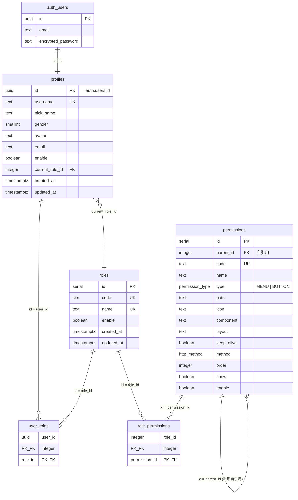
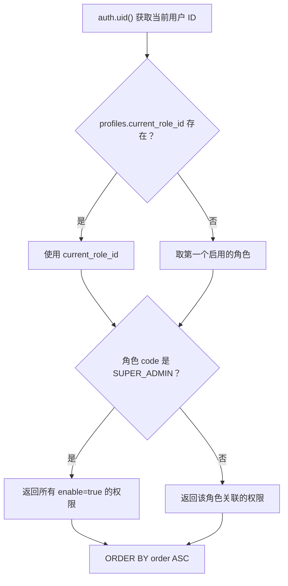

# Supabase 数据库与 RPC 函数设计文档

## 概述

本项目使用 Supabase（PostgreSQL）替代原有的 MySQL + NestJS 后端。数据库配置通过 4 个 migration SQL 文件管理，位于 `supabase/migrations/` 目录。

```
supabase/migrations/
├── 001_create_tables.sql      ← 建表 + 触发器 + 索引
├── 002_rls_policies.sql       ← Row Level Security 策略
├── 003_rpc_functions.sql      ← RPC 函数（替代 Nest Service 层）
└── 004_seed_data.sql          ← 种子数据
```

---

## 1. 表结构（001_create_tables.sql）

### 1.1 ER 关系图



### 1.2 与原 MySQL 的差异

| 变更项 | 原 MySQL | Supabase PostgreSQL |
|--------|---------|-------------------|
| 用户认证 | `user` 表存 `password` + 手动 `bcrypt` | `auth.users` 内置密码管理 |
| 用户 ID | `int AUTO_INCREMENT` | `uuid`（由 Supabase Auth 生成） |
| 命名风格 | camelCase（`parentId`, `keepAlive`） | snake_case（`parent_id`, `keep_alive`） |
| Profile 关联 | `profile.userId → user.id` 外键 | `profiles.id = auth.users.id` 直接一对一 |
| 时间戳 | `datetime(6)` 仅 user 表有 | `timestamptz` 所有表统一 |
| 枚举类型 | VARCHAR 存字符串 | PostgreSQL `ENUM`（`permission_type`, `http_method`） |

### 1.3 自动触发器

| 触发器 | 表 | 时机 | 作用 |
|--------|---|------|------|
| `trigger_*_updated_at` | profiles, roles, permissions | BEFORE UPDATE | 自动更新 `updated_at` |
| `on_auth_user_created` | `auth.users` | AFTER INSERT | 自动创建 `profiles` 行 |

---

## 2. RLS 策略（002_rls_policies.sql）

RLS（Row Level Security）替代了原 NestJS 中的 Guard 体系：

| 原 NestJS Guard | Supabase RLS 替代 |
|-----------------|------------------|
| `JwtGuard` | Supabase Auth 自动验证（`TO authenticated`） |
| `RoleGuard` + `@Roles('SUPER_ADMIN')` | `is_super_admin()` 辅助函数 |
| `PreviewGuard` | Server Action 中检查 `process.env.IS_PREVIEW` |

### 2.1 辅助函数

```sql
is_super_admin() → boolean
```
判断当前用户是否拥有 `SUPER_ADMIN` 角色。在多个 RLS policy 中复用。

### 2.2 策略矩阵

| 表 | SELECT | INSERT | UPDATE | DELETE |
|----|--------|--------|--------|--------|
| `profiles` | 自己 or 超管 | 触发器自动 | 自己 or 超管 | admin client |
| `roles` | 所有已认证用户 | 超管 | 超管 | 超管 |
| `permissions` | 自己角色关联 or 超管 | 超管 | 超管 | 超管 |
| `user_roles` | 自己 or 超管 | 超管 | — | 超管 |
| `role_permissions` | 所有已认证用户 | 超管 | — | 超管 |

> **安全原则**：写操作的管理功能统一通过 `createAdminClient()`（service role key，绕过 RLS）在 Server Action 中执行，避免 RLS 策略过于复杂。

---

## 3. RPC 函数（003_rpc_functions.sql）

RPC 函数通过 `supabase.rpc('function_name', { args })` 调用，替代原 NestJS Service 层的复杂业务逻辑。

### 3.1 函数清单

| 函数 | 参数 | 返回 | 替代的原 Nest 端点 |
|------|------|------|------------------|
| `get_current_user_permissions()` | 无 | `permissions[]` | `GET /role/permissions/tree` |
| `get_menu_tree()` | 无 | `jsonb`（嵌套树） | `GET /permission/menu/tree` |
| `validate_menu_path(path_to_check)` | `text` | `boolean` | `GET /permission/menu/validate` |
| `get_user_roles_detail()` | 无 | `jsonb`（角色数组） | `GET /user/detail` 中的 roles |
| `switch_current_role(target_role_id)` | `integer` | `boolean` | `POST /auth/current-role/switch` |

### 3.2 调用示例

#### TypeScript（在 Server Component 或 Server Action 中）

```typescript
import { createClient } from "@/lib/supabase/server";

// 获取当前用户的权限列表
const supabase = await createClient();
const { data: permissions } = await supabase.rpc("get_current_user_permissions");

// 获取菜单树（嵌套 JSON）
const { data: menuTree } = await supabase.rpc("get_menu_tree");

// 校验路径
const { data: isValid } = await supabase.rpc("validate_menu_path", {
  path_to_check: "/pms/user"
});

// 获取当前用户的角色列表
const { data: roles } = await supabase.rpc("get_user_roles_detail");

// 切换角色
const { data, error } = await supabase.rpc("switch_current_role", {
  target_role_id: 2
});
```

#### 在 lib/auth.ts 中已封装的调用

```typescript
// 这些函数使用 React cache() 实现请求级去重
import { getCurrentUser, getCurrentProfile, getCurrentPermissions } from "@/lib";

// 在 Server Component 中直接使用
const user = await getCurrentUser();          // → User | null
const profile = await getCurrentProfile();    // → Profile | null
const perms = await getCurrentPermissions();  // → Permission[]
```

### 3.3 get_current_user_permissions() 逻辑流程



### 3.4 get_menu_tree() 输出格式

```json
[
  {
    "id": 9,
    "code": "Base",
    "name": "基础功能",
    "type": "MENU",
    "path": "",
    "icon": "i-fe:grid",
    "order": 0,
    "show": true,
    "children": [
      {
        "id": 14,
        "code": "Icon",
        "name": "图标 Icon",
        "path": "/base/icon",
        "icon": "i-fe:feather",
        "order": 0,
        "children": []
      }
    ]
  }
]
```

### 3.5 validate_menu_path() 路径匹配

原 NestJS 使用 `path-to-regexp` 库，RPC 函数用 PostgreSQL 正则近似实现：

| 原路径模式 | 转换后正则 | 匹配示例 |
|-----------|----------|---------|
| `/pms/user` | `^/pms/user$` | `/pms/user` ✅ |
| `/pms/role/user/:roleId` | `^/pms/role/user/[^/]+$` | `/pms/role/user/123` ✅ |

---

## 4. 种子数据（004_seed_data.sql）

### 4.1 预置角色

| ID | Code | Name |
|----|------|------|
| 1 | `SUPER_ADMIN` | 超级管理员 |
| 2 | `ROLE_QA` | 质检员 |

### 4.2 预置权限（16 条）

菜单树结构：
```
├── 基础功能 (Base)              order=0
│   ├── 图标 Icon (Icon)         order=0
│   ├── 基础组件 (BaseComponents) order=1
│   ├── Unocss                   order=2
│   ├── KeepAlive                order=3
│   └── MeModal (TestModal)      order=5
├── 业务示例 (Demo)              order=1
│   └── 图片上传 (ImgUpload)     order=2
├── 系统管理 (SysMgt)            order=2
│   ├── 资源管理 (Resource_Mgt)  order=1
│   ├── 角色管理 (RoleMgt)       order=2
│   │   └── 分配用户 (RoleUser)  order=1 [隐藏]
│   └── 用户管理 (UserMgt)       order=3
│       ├── [按钮] 创建新用户
│       └── [按钮] 超管专属
└── 个人资料 (UserProfile)       order=99 [隐藏]
```

### 4.3 Admin 用户创建

Supabase Auth 用户不能直接 SQL 插入，需要两步操作：

**步骤 1：通过 Supabase Dashboard 或 Admin API 创建用户**

```typescript
// 使用 createAdminClient()
const supabase = createAdminClient();
const { data } = await supabase.auth.admin.createUser({
  email: "admin@example.com",
  password: "your-secure-password",
  email_confirm: true,
  user_metadata: { username: "admin" }
});
// data.user.id → UUID
```

**步骤 2：关联角色**

```sql
-- 替换 <UUID> 为实际 ID
UPDATE profiles SET username = 'admin', nick_name = 'Admin', current_role_id = 1
WHERE id = '<UUID>';

INSERT INTO user_roles (user_id, role_id) VALUES
  ('<UUID>', 1),  -- SUPER_ADMIN
  ('<UUID>', 2);  -- ROLE_QA
```

---

## 5. 如何执行迁移

### 方式 A：Supabase CLI（推荐）

```bash
# 安装 Supabase CLI
npm install -g supabase

# 登录并关联项目
supabase login
supabase link --project-ref <project-id>

# 执行迁移
supabase db push
```

### 方式 B：Supabase Dashboard

1. 进入 Supabase Dashboard → SQL Editor
2. 按顺序粘贴执行：`001` → `002` → `003` → `004`
3. 每个文件单独执行，确认无报错

### 方式 C：生成类型文件

迁移完成后，可用 CLI 自动生成 TypeScript 类型替换手写的 `types.ts`：

```bash
supabase gen types typescript --project-id <project-id> > src/lib/supabase/types.ts
```

---

## 6. types.ts 与 SQL 的对应关系

| SQL 对象 | TypeScript 类型位置 |
|----------|-------------------|
| `profiles` 表 | `Database["public"]["Tables"]["profiles"]` |
| `roles` 表 | `Database["public"]["Tables"]["roles"]` |
| `permissions` 表 | `Database["public"]["Tables"]["permissions"]` |
| `user_roles` 表 | `Database["public"]["Tables"]["user_roles"]` |
| `role_permissions` 表 | `Database["public"]["Tables"]["role_permissions"]` |
| `get_current_user_permissions()` | `Database["public"]["Functions"]["get_current_user_permissions"]` |
| `get_menu_tree()` | `Database["public"]["Functions"]["get_menu_tree"]` |
| `validate_menu_path()` | `Database["public"]["Functions"]["validate_menu_path"]` |
| `get_user_roles_detail()` | `Database["public"]["Functions"]["get_user_roles_detail"]` |
| `switch_current_role()` | `Database["public"]["Functions"]["switch_current_role"]` |
| `permission_type` 枚举 | `PermissionType` ("MENU" \| "BUTTON") |
| `http_method` 枚举 | `HttpMethod` ("GET" \| "POST" \| ...) |
